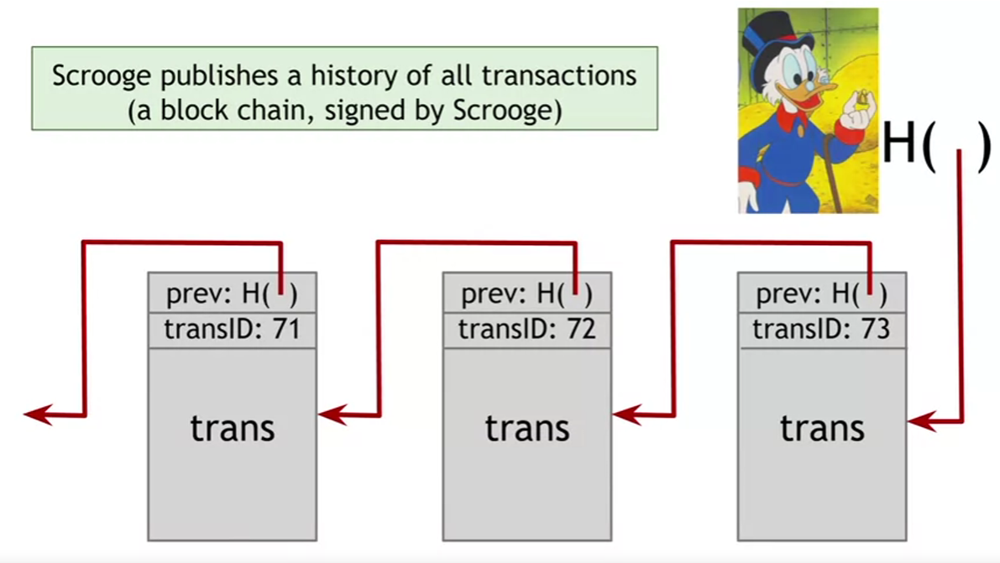
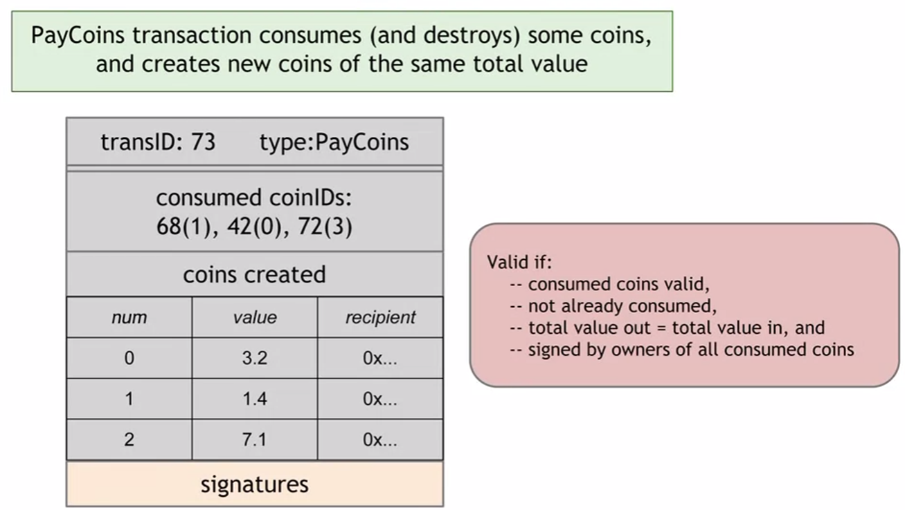

# ScroogeCoin
In this project, we implement the blockchain of a cryptocurrency "ScroogeCoin".
ScroogeCoin is a digital currency project that uses a simplified blockchain for transactions. It allows users to create, transfer, and validate transactions through a central authority (Scrooge) while ensuring transaction integrity and preventing double-spending.

## Blockchain design

## Block(Transaction) block
